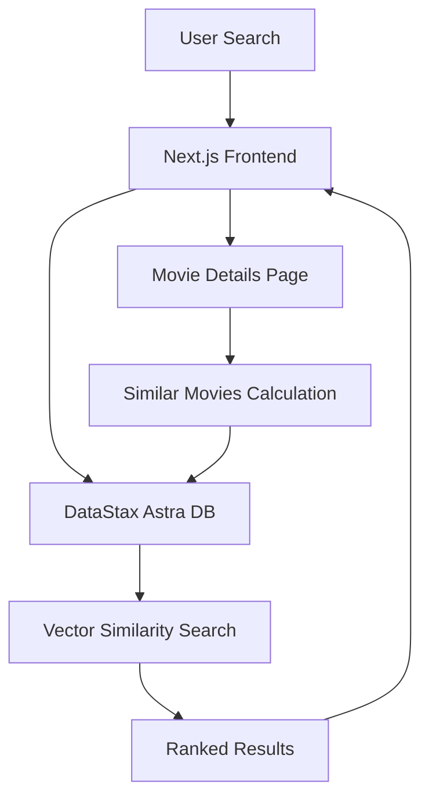

#  VectorCinema


*AI-Powered Movie Discovery Through Vector Similarity*

---

A modern, intelligent movie recommendation system built with **Next.js 14**, **DataStax Astra DB**, and **AI-powered vector embeddings**. Discover movies through semantic search and get personalized recommendations based on advanced similarity algorithms.


## ✨ Features

### 🔍 **Intelligent Search**
- **Semantic Search**: Use natural language to find movies (e.g., "Sci-Fi films in space", "romantic comedies")
- **Vector-Powered**: AI embeddings understand context and meaning, not just keywords
- **Real-time Results**: Instant search with ranked results by relevance

### 🎯 **Smart Recommendations**
- **AI-Driven Similarity**: Get movies similar to any film based on genre, plot, and themes
- **Dynamic Suggestions**: Each movie shows unique recommendations calculated in real-time
- **Similarity Scores**: See percentage match ratings for recommended movies

### 🎨 **Modern UI/UX**
- **Responsive Design**: Beautiful interface that works on all devices
- **Movie Posters**: High-quality images with fallback system
- **Smooth Navigation**: Intuitive browsing experience
- **Gradient Themes**: Eye-catching purple-to-blue gradient design

### 🏗️ **Technical Excellence**
- **Next.js 14**: Latest React framework with App Router
- **Vector Database**: DataStax Astra DB for scalable similarity search
- **TypeScript**: Full type safety and developer experience
- **Performance**: 24-hour caching and optimized queries

## 🚀 Quick Start

### Prerequisites

- **Node.js** 18+ 
- **npm** or **yarn**
- **DataStax Astra DB** account (free tier available)

### 1. Clone the Repository

```bash
git clone https://github.com/sudhansu-24/Movie-Recommendation-System.git
cd Movie-Recommendation-System
```

### 2. Install Dependencies

```bash
npm install
# or
yarn install
```

### 3. Set Up Environment Variables

```bash
# Copy the example environment file
cp .env.example .env.local

# Edit .env.local with your actual credentials
nano .env.local  # or use your preferred editor
```

**Required Environment Variables:**
```bash
ASTRA_DB_APPLICATION_TOKEN=AstraCS:your_astra_token_here
ASTRA_DB_API_ENDPOINT=https://your-database-id-region.apps.astra.datastax.com
OPENAI_API_KEY=sk-your_openai_api_key_here  # Optional
```

### 4. Run the Development Server

```bash
npm run dev
# or
yarn dev
```

Open [http://localhost:3000](http://localhost:3000) to see your movie recommendation system! 🎉

## 🗄️ Database Setup

### DataStax Astra DB Configuration

1. **Create Account**: Sign up at [DataStax Astra](https://astra.datastax.com/)
2. **Create Database**: 
   - Choose "Serverless (Vector)" 
   - Select "Amazon Web Services" provider
   - Choose "us-east-2" region (required for NVIDIA embeddings)
3. **Get Credentials**:
   - Copy your **Database API Endpoint**
   - Generate and copy your **Application Token**
4. **Create Collection**: The app will connect and display available collections

### Sample Data

The project includes `SAMPLE_DATA.csv` with 250+ movies including:
- **Classics**: The Shawshank Redemption, The Godfather, Casablanca
- **Modern Hits**: Interstellar, Parasite, Dune
- **Various Genres**: Action, Comedy, Drama, Sci-Fi, Horror, Romance

## 🏛️ Architecture

### Technology Stack

```
Frontend (Next.js 14)
├── React 18 with TypeScript
├── Tailwind CSS for styling
├── Next.js Image optimization
└── Responsive grid layouts

Backend (Serverless)
├── Next.js API routes
├── DataStax Astra DB client
├── Vector similarity search
└── OpenAI embeddings (optional)

Database (DataStax Astra DB)
├── Vector-enabled collections
├── Automatic embedding generation
├── Similarity search with scoring
└── Scalable cloud infrastructure
```

### Data Flow



### Key Components

- **`app/page.tsx`**: Homepage with movie grid
- **`app/search/[term]/page.tsx`**: Search results with vector search
- **`app/movie/[id]/page.tsx`**: Individual movie details and recommendations
- **`components/MoviePoster.tsx`**: Reusable movie card component
- **`components/SearchInput.tsx`**: Search interface with server actions
- **`db.ts`**: DataStax Astra DB connection and configuration

## 🔧 Advanced Configuration

### Vector Search Options

The system supports two types of vector similarity search:

1. **Pre-computed Vectors** (if available):
```typescript
sort: { $vector: movie.$vector }
```

2. **Dynamic Vectorization** (automatic):
```typescript
vectorize: `${movie.Title} ${movie.Genre} ${movie.Director}`
```

### Embedding Models

- **Default**: NVIDIA NV-Embed-QA (hosted by Astra)
- **Custom**: OpenAI text-embedding-3-large (requires API key)
- **Dimensions**: 512-dimensional vectors for optimal performance

### Performance Optimizations

- **Caching**: 24-hour static generation (`revalidate: 60 * 60 * 24`)
- **Image Optimization**: Next.js Image component with fallbacks
- **Vector Exclusion**: Efficient queries that exclude heavy vector data when not needed
- **Connection Pooling**: Optimized database connections

## 🎯 Usage Examples

### Search Queries

Try these natural language searches:

```
"Sci-Fi films in space"
"Romantic comedies from the 90s"
"Dark psychological thrillers"
"Action movies with superheroes"
"Classic black and white films"
"Movies about time travel"
```

### API Usage

The system provides clean, RESTful routes:

- **Homepage**: `/` - Browse all movies
- **Search**: `/search/[query]` - Vector-powered search results
- **Movie Details**: `/movie/[id]` - Individual movie with recommendations

## 🛠️ Development

### Project Structure

```
VectorCinema/
├── app/                    # Next.js 14 App Router
│   ├── movie/[id]/        # Movie details pages
│   ├── search/[term]/     # Search results pages
│   ├── globals.css        # Global styles
│   ├── layout.tsx         # Root layout
│   └── page.tsx           # Homepage
├── components/            # Reusable components
│   ├── Header.tsx         # Navigation header
│   ├── MoviePoster.tsx    # Movie card component
│   ├── SearchInput.tsx    # Search interface
│   └── ImageWithFallback.tsx # Image error handling
├── public/               # Static assets
├── types.ts             # TypeScript definitions
├── db.ts               # Database configuration
└── README.md          # This file
```

### Code Style

- **TypeScript**: Strict mode enabled
- **ESLint**: Next.js recommended configuration
- **Comments**: JSDoc3 style documentation
- **Naming**: Descriptive variable and function names

### Adding New Features

1. **New Movie Fields**: Update `types.ts` and database schema
2. **Search Filters**: Modify search queries in `app/search/[term]/page.tsx`
3. **UI Components**: Add to `components/` directory
4. **Styling**: Use Tailwind CSS classes

## 🚀 Deployment

### Vercel (Recommended)

1. **Connect Repository**: Link your GitHub repository to Vercel
2. **Environment Variables**: Add your environment variables in Vercel dashboard
3. **Deploy**: Automatic deployments on every push to main branch

```bash
# Install Vercel CLI
npm install -g vercel

# Deploy
vercel --prod
```

### Other Platforms

The application can be deployed on any platform that supports Next.js:
- **Netlify**
- **AWS Amplify** 
- **Railway**
- **DigitalOcean App Platform**

## 🔒 Security

### Environment Variables

- **Never commit** `.env` or `.env.local` files
- **Use** `.env.example` for documentation
- **Rotate keys** regularly for production deployments

### API Keys

- **DataStax Tokens**: Scope to minimum required permissions
- **OpenAI Keys**: Monitor usage and set billing limits
- **Rate Limiting**: Implement for production use

## 🐛 Troubleshooting

### Common Issues

**"Cannot connect to Astra DB"**
- Verify your `ASTRA_DB_APPLICATION_TOKEN` and `ASTRA_DB_API_ENDPOINT`
- Check if your database is in "Active" status
- Ensure you're using the correct region

**"Image loading errors"**
- Movie poster URLs may be outdated - the fallback system handles this
- Check your internet connection
- Verify Next.js image domains in `next.config.mjs`

**"No similar movies found"**
- Ensure your database has movies with vector embeddings
- Check if the movie has the `$vectorize` field populated
- Verify your embedding model configuration

### Debug Mode

Enable debug logging by checking the browser console and terminal output when viewing movie details. The system provides detailed information about:
- Vector existence and length
- Similarity scores
- Query performance
- Database connections

## 🤝 Contributing

1. **Fork** the repository
2. **Create** a feature branch (`git checkout -b feature/amazing-feature`)
3. **Commit** your changes (`git commit -m 'Add amazing feature'`)
4. **Push** to the branch (`git push origin feature/amazing-feature`)
5. **Open** a Pull Request

### Development Guidelines

- Follow TypeScript best practices
- Add proper error handling
- Include tests for new features
- Update documentation for API changes
- Use semantic commit messages

THIS IS ONLY FOR EDUCATIONAL PURPOSE

---

**⭐ Star this repository if you found it helpful!**

